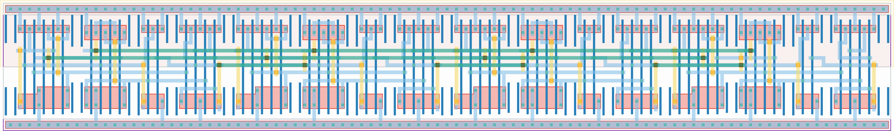

# `bit_cnt_chain` Module


## Cell Hierarchy

`bit_cnt_chain` **60** (number MOS pairs)
- `tff_st_ar` **15** *x4*

## Netlist

```
.SUBCKT bit_cnt_chain clk out<0> out<1> out<2> out<3> rst rst' vdd vss
    Xi3 net13 out<3> net16 rst rst' vdd vss tff_st_ar
    Xi2 net14 out<2> net13 rst rst' vdd vss tff_st_ar
    Xi1 net15 out<1> net14 rst rst' vdd vss tff_st_ar
    Xi0 clk out<0> net15 rst rst' vdd vss tff_st_ar
.ENDS
```
