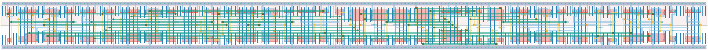

# `bit_control` Module


## Cell Hierarchy

`bit_control` **119** (number MOS pairs)
- `dff_st_ar` **15** *x4*
- `nand3` **3**
- `nand2` **2** *x3*
- `nor2` **2** *x3*
- `inv` **1** *x3*
- `nor4` **4**
- `bit_rst_fb` **23**
- `dff_st_ar_dh` **14**

## Netlist

```
.SUBCKT bit_control bit_cnt<0> bit_cnt<1> bit_cnt<2> bit_cnt<3> bit_data<0> bit_data<1> bit_data<2>
                    + bit_data<3> bit_data<4> bit_data<5> bit_data<6> bit_data<7> bit_ready bit_rst
                    + bit_rst' extclk_cnt<0> extclk_cnt<1> extclk_cnt<2> extclk_cnt<3> extclk_cnt<4>
                    + ext_clk ready_clk rst_glob rst_glob' vdd vdl_rst_loc vdl_rst_loc' vss
    Xi23 ready_clk net024 vdl_rst_1 vdl_rst_1' bit_rst bit_rst' vdd vss dff_st_ar
    Xi8 ext_clk nor4 bit_rst_loc bit_rst_loc' bit_rst_rst bit_rst_rst' vdd vss dff_st_ar
    Xi4 net09 vdl_rst_loc vdl_rst_rst_loc vdl_rst_rst_loc' vdl_rst_loc' vdl_rst_loc vdd vss
        + dff_st_ar
    Xi0 ready_clk nand3 vdl_rst_0 vdl_rst_0' vdl_rst_rst vdl_rst_rst' vdd vss dff_st_ar
    Xi20 bit_cnt<2> bit_cnt<1> bit_cnt<0> nand3 vdd vss nand3
    Xi21 vdl_rst_0' vdl_rst_1' vdl_rst_loc vdd vss nand2
    Xi14 bit_rst_loc' rst_glob' bit_rst vdd vss nand2
    Xi6 bit_rst' vdl_rst_rst_loc' vdl_rst_rst vdd vss nand2
    Xi22 vdl_rst_0 vdl_rst_1 vdl_rst_loc' vdd vss nor2
    Xi15 bit_rst_loc rst_glob bit_rst' vdd vss nor2
    Xi7 bit_rst vdl_rst_rst_loc vdl_rst_rst' vdd vss nor2
    Xi25 nand3 net024 vdd vss inv
    Xi12 extclk_cnt<3> net041 vdd vss inv
    Xi17 ready_clk net09 vdd vss inv
    Xi11 extclk_cnt<0> extclk_cnt<1> extclk_cnt<2> net041 nor4 vdd vss nor4
    Xi26 bit_cnt<0> bit_cnt<1> bit_cnt<2> bit_cnt<3> bit_data<0> bit_data<1> bit_data<2> bit_data<3>
         + bit_data<4> bit_data<5> bit_data<6> bit_data<7> extclk_cnt<0> extclk_cnt<1> extclk_cnt<2>
         + extclk_cnt<3> extclk_cnt<4> bit_rst_rst bit_rst_rst' vdd vdl_rst_1' vss bit_rst_fb
    Xi10 bit_cnt<3> bit_ready net017 bit_rst bit_rst' vdd vss dff_st_ar_dh
.ENDS
```
