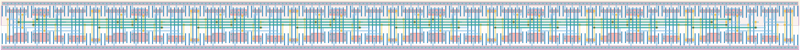

# `bit_data_chain` Module


## Cell Hierarchy

`bit_data_chain` **136** (number MOS pairs)
- `dff_inv` **17** *x8*

## Netlist

```
.SUBCKT bit_data_chain clk in out<0> out<1> out<2> out<3> out<4> out<5> out<6> out<7> rst rst' vdd
                       + vss
    Xi14 clk out<5> out<6> rst rst' vdd vss dff_inv
    Xi13 clk out<4> out<5> rst rst' vdd vss dff_inv
    Xi12 clk out<3> out<4> rst rst' vdd vss dff_inv
    Xi11 clk out<2> out<3> rst rst' vdd vss dff_inv
    Xi10 clk out<1> out<2> rst rst' vdd vss dff_inv
    Xi9 clk out<0> out<1> rst rst' vdd vss dff_inv
    Xi8 clk in out<0> rst rst' vdd vss dff_inv
    Xi15 clk out<6> out<7> rst rst' vdd vss dff_inv
.ENDS
```
