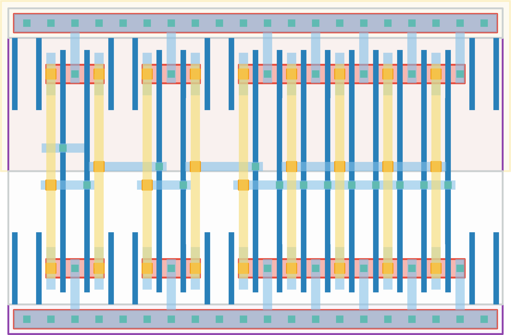

# `clk_delay_6` Module


## Cell Hierarchy

`clk_delay_6` **6** (number MOS pairs)
- `n_mos` **0** *x6*
- `p_mos` **0** *x6*

## Netlist

```
.SUBCKT clk_delay_6 in out vdd vss
    Mm5 out net14 vss vss n_mos l=30n w=100n m=8 nf=1
    Mm4 net14 net12 vss vss n_mos l=30n w=100n m=1 nf=1
    Mm3 net12 net10 vss vss n_mos l=30n w=100n m=1 nf=1
    Mm2 net10 net8 vss vss n_mos l=30n w=100n m=1 nf=1
    Mm1 net8 net4 vss vss n_mos l=30n w=100n m=1 nf=1
    Mm0 net4 in vss vss n_mos l=30n w=100n m=1 nf=1
    Mm11 out net14 vdd vdd p_mos l=30n w=100n m=8 nf=1
    Mm10 net14 net12 vdd vdd p_mos l=30n w=100n m=1 nf=1
    Mm9 net12 net10 vdd vdd p_mos l=30n w=100n m=1 nf=1
    Mm8 net10 net8 vdd vdd p_mos l=30n w=100n m=1 nf=1
    Mm7 net8 net4 vdd vdd p_mos l=30n w=100n m=1 nf=1
    Mm6 net4 in vdd vdd p_mos l=30n w=100n m=1 nf=1
.ENDS
```
