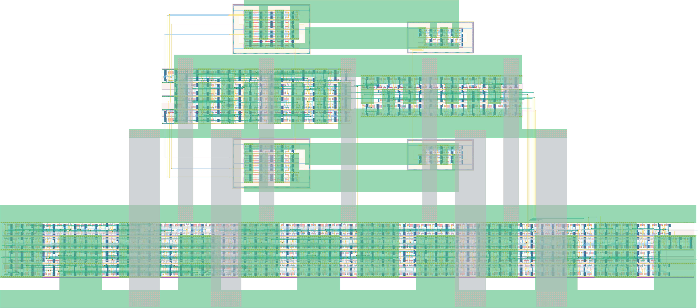

# `control_dc_vdl_send_combo` Module


## Cell Hierarchy

`control_dc_vdl_send_combo` **2523** (number MOS pairs)
- `core_control` **239**
- `dc_vdl_combo` **981**
- `send_top` **1303**

## Netlist

```
.SUBCKT control_dc_vdl_send_combo conf_bit'cnt conf_dc0'<0> conf_dc0'<1> conf_dc0'<2> conf_dc0'<3>
                                  + conf_dc0'<4> conf_dc0'<5> conf_dc0'<6> conf_dc0'<7> conf_dc0'<8>
                                  + conf_dc0'<9> conf_dc0'<10> conf_dc0'<11> conf_dc0'<12>
                                  + conf_dc0'<13> conf_dc0'<14> conf_dc0'<15> conf_dc0<0>
                                  + conf_dc0<1> conf_dc0<2> conf_dc0<3> conf_dc0<4> conf_dc0<5>
                                  + conf_dc0<6> conf_dc0<7> conf_dc0<8> conf_dc0<9> conf_dc0<10>
                                  + conf_dc0<11> conf_dc0<12> conf_dc0<13> conf_dc0<14> conf_dc0<15>
                                  + conf_dc1'<0> conf_dc1'<1> conf_dc1'<2> conf_dc1'<3> conf_dc1'<4>
                                  + conf_dc1'<5> conf_dc1'<6> conf_dc1'<7> conf_dc1'<8> conf_dc1'<9>
                                  + conf_dc1'<10> conf_dc1'<11> conf_dc1'<12> conf_dc1'<13>
                                  + conf_dc1'<14> conf_dc1'<15> conf_dc1<0> conf_dc1<1> conf_dc1<2>
                                  + conf_dc1<3> conf_dc1<4> conf_dc1<5> conf_dc1<6> conf_dc1<7>
                                  + conf_dc1<8> conf_dc1<9> conf_dc1<10> conf_dc1<11> conf_dc1<12>
                                  + conf_dc1<13> conf_dc1<14> conf_dc1<15> conf_enhigh_dc
                                  + conf_enhigh_vdl conf_enhigh_vdl' conf_fb conf_freqsel<0>
                                  + conf_freqsel<1> conf_rochoose<0> conf_rochoose<1> conf_roen
                                  + conf_rofreq<0> conf_rofreq<1> conf_rofreq<2> conf_rst conf_rst'
                                  + conf_vdl0'<0> conf_vdl0'<1> conf_vdl0'<2> conf_vdl0'<3>
                                  + conf_vdl0'<4> conf_vdl0'<5> conf_vdl0'<6> conf_vdl0'<7>
                                  + conf_vdl0'<8> conf_vdl0'<9> conf_vdl0'<10> conf_vdl0'<11>
                                  + conf_vdl0'<12> conf_vdl0'<13> conf_vdl0'<14> conf_vdl0'<15>
                                  + conf_vdl0<0> conf_vdl0<1> conf_vdl0<2> conf_vdl0<3> conf_vdl0<4>
                                  + conf_vdl0<5> conf_vdl0<6> conf_vdl0<7> conf_vdl0<8> conf_vdl0<9>
                                  + conf_vdl0<10> conf_vdl0<11> conf_vdl0<12> conf_vdl0<13>
                                  + conf_vdl0<14> conf_vdl0<15> conf_vdl1'<0> conf_vdl1'<1>
                                  + conf_vdl1'<2> conf_vdl1'<3> conf_vdl1'<4> conf_vdl1'<5>
                                  + conf_vdl1'<6> conf_vdl1'<7> conf_vdl1'<8> conf_vdl1'<9>
                                  + conf_vdl1'<10> conf_vdl1'<11> conf_vdl1'<12> conf_vdl1'<13>
                                  + conf_vdl1'<14> conf_vdl1'<15> conf_vdl1<0> conf_vdl1<1>
                                  + conf_vdl1<2> conf_vdl1<3> conf_vdl1<4> conf_vdl1<5> conf_vdl1<6>
                                  + conf_vdl1<7> conf_vdl1<8> conf_vdl1<9> conf_vdl1<10>
                                  + conf_vdl1<11> conf_vdl1<12> conf_vdl1<13> conf_vdl1<14>
                                  + conf_vdl1<15> data_out data_ready ext_clk ext_rst ext_start
                                  + ro_out vdd vdd_0 vdd_1 vss vss_0 vss_1
    Xi5 conf_rochoose<0> conf_rochoose<1> conf_roen conf_rofreq<0> conf_rofreq<1> conf_rofreq<2>
        + conf_rst conf_rst' ext_rst ext_rst' ro_in<0> ro_in<1> ro_in<2> ro_in<3> ro_out vdd vss
        + core_control
    Xi4 conf_dc0'<0> conf_dc0'<1> conf_dc0'<2> conf_dc0'<3> conf_dc0'<4> conf_dc0'<5> conf_dc0'<6>
        + conf_dc0'<7> conf_dc0'<8> conf_dc0'<9> conf_dc0'<10> conf_dc0'<11> conf_dc0'<12>
        + conf_dc0'<13> conf_dc0'<14> conf_dc0'<15> conf_dc0<0> conf_dc0<1> conf_dc0<2> conf_dc0<3>
        + conf_dc0<4> conf_dc0<5> conf_dc0<6> conf_dc0<7> conf_dc0<8> conf_dc0<9> conf_dc0<10>
        + conf_dc0<11> conf_dc0<12> conf_dc0<13> conf_dc0<14> conf_dc0<15> conf_dc1'<0> conf_dc1'<1>
        + conf_dc1'<2> conf_dc1'<3> conf_dc1'<4> conf_dc1'<5> conf_dc1'<6> conf_dc1'<7> conf_dc1'<8>
        + conf_dc1'<9> conf_dc1'<10> conf_dc1'<11> conf_dc1'<12> conf_dc1'<13> conf_dc1'<14>
        + conf_dc1'<15> conf_dc1<0> conf_dc1<1> conf_dc1<2> conf_dc1<3> conf_dc1<4> conf_dc1<5>
        + conf_dc1<6> conf_dc1<7> conf_dc1<8> conf_dc1<9> conf_dc1<10> conf_dc1<11> conf_dc1<12>
        + conf_dc1<13> conf_dc1<14> conf_dc1<15> conf_enhigh_dc conf_enhigh_vdl conf_enhigh_vdl'
        + conf_fb conf_freqsel<0> conf_freqsel<1> conf_vdl0'<0> conf_vdl0'<1> conf_vdl0'<2>
        + conf_vdl0'<3> conf_vdl0'<4> conf_vdl0'<5> conf_vdl0'<6> conf_vdl0'<7> conf_vdl0'<8>
        + conf_vdl0'<9> conf_vdl0'<10> conf_vdl0'<11> conf_vdl0'<12> conf_vdl0'<13> conf_vdl0'<14>
        + conf_vdl0'<15> conf_vdl0<0> conf_vdl0<1> conf_vdl0<2> conf_vdl0<3> conf_vdl0<4>
        + conf_vdl0<5> conf_vdl0<6> conf_vdl0<7> conf_vdl0<8> conf_vdl0<9> conf_vdl0<10>
        + conf_vdl0<11> conf_vdl0<12> conf_vdl0<13> conf_vdl0<14> conf_vdl0<15> conf_vdl1'<0>
        + conf_vdl1'<1> conf_vdl1'<2> conf_vdl1'<3> conf_vdl1'<4> conf_vdl1'<5> conf_vdl1'<6>
        + conf_vdl1'<7> conf_vdl1'<8> conf_vdl1'<9> conf_vdl1'<10> conf_vdl1'<11> conf_vdl1'<12>
        + conf_vdl1'<13> conf_vdl1'<14> conf_vdl1'<15> conf_vdl1<0> conf_vdl1<1> conf_vdl1<2>
        + conf_vdl1<3> conf_vdl1<4> conf_vdl1<5> conf_vdl1<6> conf_vdl1<7> conf_vdl1<8> conf_vdl1<9>
        + conf_vdl1<10> conf_vdl1<11> conf_vdl1<12> conf_vdl1<13> conf_vdl1<14> conf_vdl1<15>
        + ro_in<0> ro_in<1> ext_start rand ready ext_rst ext_rst' vdd vdd_0 vdd_1 ro_in<2> ro_in<3>
        + vdl_rst vdl_rst' vss vss_0 vss_1 dc_vdl_combo
    Xi2 conf_bit'cnt data_out data_ready ext_clk rand ready ext_rst ext_rst' vdd vdl_rst vdl_rst'
        + vss send_top
.ENDS
```
