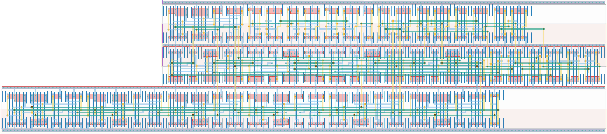

# `core_control` Module


## Cell Hierarchy

`core_control` **239** (number MOS pairs)
- `mux4` **21**
- `freq_scaler` **165**
- `mux8` **49**
- `nand2` **2**
- `inv` **1** *x2*

## Netlist

```
.SUBCKT core_control conf_rochoose<0> conf_rochoose<1> conf_roen conf_rofreq<0> conf_rofreq<1>
                     + conf_rofreq<2> conf_rst conf_rst' ext_rst ext_rst' ro_in<0> ro_in<1> ro_in<2>
                     + ro_in<3> ro_out vdd vss
    Xi0 ro_in<0> ro_in<1> ro_in<2> ro_in<3> net1 conf_rochoose<0> conf_rochoose<1> vdd vss mux4
    Xi1 net07 net08<0> net08<1> net08<2> net08<3> net08<4> net08<5> net08<6> net08<7> ext_rst
        + ext_rst' vdd vss freq_scaler
    Xi2 net08<0> net08<1> net08<2> net08<3> net08<4> net08<5> net08<6> net08<7> ro_out
        + conf_rofreq<0> conf_rofreq<1> conf_rofreq<2> vdd vss mux8
    Xi3 net1 conf_roen net07 vdd vss nand2
    Xi5 ext_rst ext_rst' vdd vss inv
    Xi4 conf_rst conf_rst' vdd vss inv
.ENDS
```
