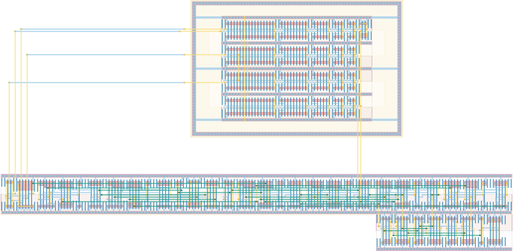

# `dc_branch` Module


## Cell Hierarchy

`dc_branch` **272** (number MOS pairs)
- `first_edge` **14**
- `mux4` **21**
- `enable_n` **38**
- `nand2` **2**
- `freq_scaler_248` **45**
- `dc_ch_4` **140**
- `inv` **1**
- `nand2_dnw` **2**
- `buf_wide` **2**
- `dc_rst_check` **7**

## Netlist

```
.SUBCKT dc_branch conf_dc'<0> conf_dc'<1> conf_dc'<2> conf_dc'<3> conf_dc'<4> conf_dc'<5>
                  + conf_dc'<6> conf_dc'<7> conf_dc'<8> conf_dc'<9> conf_dc'<10> conf_dc'<11>
                  + conf_dc'<12> conf_dc'<13> conf_dc'<14> conf_dc'<15> conf_dc<0> conf_dc<1>
                  + conf_dc<2> conf_dc<3> conf_dc<4> conf_dc<5> conf_dc<6> conf_dc<7> conf_dc<8>
                  + conf_dc<9> conf_dc<10> conf_dc<11> conf_dc<12> conf_dc<13> conf_dc<14>
                  + conf_dc<15> conf_enhigh conf_freqsel<0> conf_freqsel<1> dc_rst out out_raw rst
                  + rst' rst_glob rst_glob' start vdd vdd_dc vss vss_dc
    Xi4 mux_out out net19 rst rst' vdd vss first_edge
    Xi3 muxin<0> muxin<1> muxin<2> muxin<3> mux_out conf_freqsel<0> conf_freqsel<1> vdd vss mux4
    Xi5 out enable' rst rst' rst_glob rst_glob' start vdd vss enable_n
    Xi7 enable' conf_enhigh' enable vdd vss nand2
    Xi2 muxin<0> muxin<1> muxin<2> muxin<3> enable' enable vdd vss freq_scaler_248
    Xi1 conf_dc'<0> conf_dc'<1> conf_dc'<2> conf_dc'<3> conf_dc'<4> conf_dc'<5> conf_dc'<6>
        + conf_dc'<7> conf_dc'<8> conf_dc'<9> conf_dc'<10> conf_dc'<11> conf_dc'<12> conf_dc'<13>
        + conf_dc'<14> conf_dc'<15> conf_dc<0> conf_dc<1> conf_dc<2> conf_dc<3> conf_dc<4>
        + conf_dc<5> conf_dc<6> conf_dc<7> conf_dc<8> conf_dc<9> conf_dc<10> conf_dc<11> conf_dc<12>
        + conf_dc<13> conf_dc<14> conf_dc<15> dc_in dc_int0 dc_int1 dc_int2 muxin<0> vdd_dc vss_dc
        + dc_ch_4
    Xi6 conf_enhigh conf_enhigh' vdd vss inv
    Xi8 enable muxin<0> dc_in vdd_dc vss_dc nand2_dnw
    Xi9 muxin<0> out_raw vdd vss buf_wide
    Xi10 dc_in dc_int0 dc_int1 dc_int2 muxin<0> dc_rst vdd vss dc_rst_check
.ENDS
```
