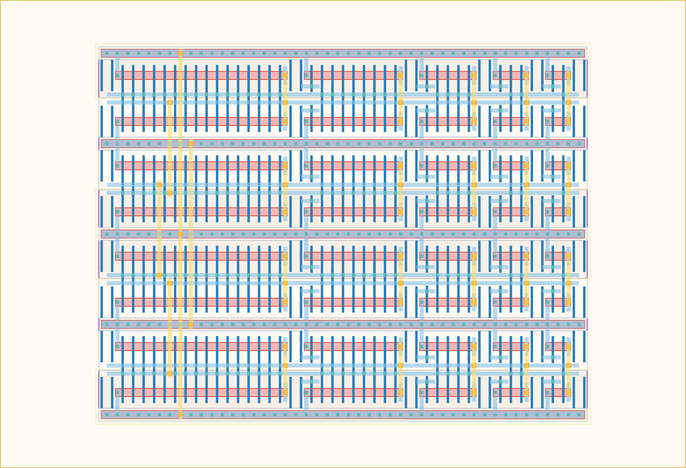

# `dc_ch_4` Module


## Cell Hierarchy

`dc_ch_4` **140** (number MOS pairs)
- `inv_ch_2` **3** *x4*
- `inv_ch_8` **9** *x4*
- `inv_ch_4` **5** *x4*
- `inv_ch_1` **2** *x4*
- `inv_ch_8l_mod` **16** *x4*

## Netlist

```
.SUBCKT dc_ch_4 conf'<0> conf'<1> conf'<2> conf'<3> conf'<4> conf'<5> conf'<6> conf'<7> conf'<8>
                + conf'<9> conf'<10> conf'<11> conf'<12> conf'<13> conf'<14> conf'<15> conf<0>
                + conf<1> conf<2> conf<3> conf<4> conf<5> conf<6> conf<7> conf<8> conf<9> conf<10>
                + conf<11> conf<12> conf<13> conf<14> conf<15> in int0 int1 int2 out vdd vss
    Xi60 conf<2> conf'<2> in int0 vdd vss inv_ch_2
    Xi61 conf<6> conf'<6> int0 int1 vdd vss inv_ch_2
    Xi62 conf<10> conf'<10> int1 int2 vdd vss inv_ch_2
    Xi63 conf<14> conf'<14> int2 out vdd vss inv_ch_2
    Xi48 conf<0> conf'<0> in int0 vdd vss inv_ch_8
    Xi51 conf<12> conf'<12> int2 out vdd vss inv_ch_8
    Xi49 conf<4> conf'<4> int0 int1 vdd vss inv_ch_8
    Xi50 conf<8> conf'<8> int1 int2 vdd vss inv_ch_8
    Xi56 conf<1> conf'<1> in int0 vdd vss inv_ch_4
    Xi59 conf<13> conf'<13> int2 out vdd vss inv_ch_4
    Xi57 conf<5> conf'<5> int0 int1 vdd vss inv_ch_4
    Xi58 conf<9> conf'<9> int1 int2 vdd vss inv_ch_4
    Xi67 conf<15> conf'<15> int2 out vdd vss inv_ch_1
    Xi66 conf<11> conf'<11> int1 int2 vdd vss inv_ch_1
    Xi65 conf<7> conf'<7> int0 int1 vdd vss inv_ch_1
    Xi64 conf<3> conf'<3> in int0 vdd vss inv_ch_1
    Xi76 in int0 vdd vss inv_ch_8l_mod
    Xi73 int0 int1 vdd vss inv_ch_8l_mod
    Xi74 int1 int2 vdd vss inv_ch_8l_mod
    Xi75 int2 out vdd vss inv_ch_8l_mod
.ENDS
```
