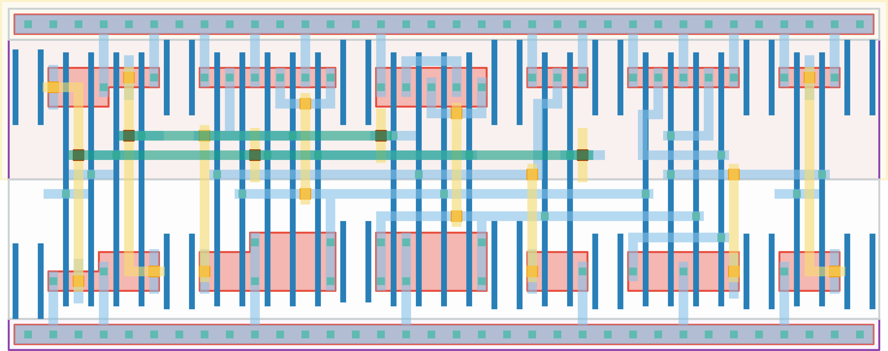

# `edge_to_level` Module


## Cell Hierarchy

`edge_to_level` **21** (number MOS pairs)
- `dff_st_ar` **15**
- `nor2` **2**
- `nand2` **2** *x2*

## Netlist

```
.SUBCKT edge_to_level conf_enhigh' edge enable enable' level rst rst' vdd vss
    Xi0 edge nor net10 level_loc' nand nor vdd vss dff_st_ar
    Xi1 enable' rst nor vdd vss nor2
    Xi3 level_loc' conf_enhigh' level vdd vss nand2
    Xi2 enable rst' nand vdd vss nand2
.ENDS
```
