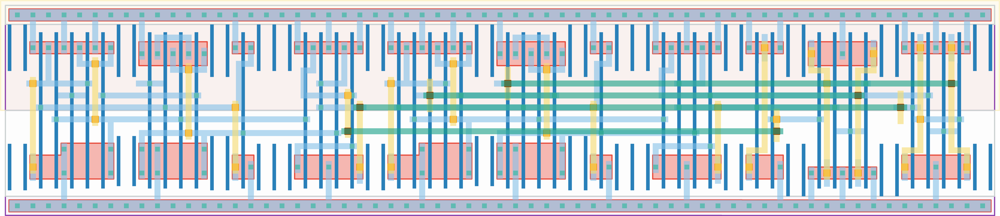

# `enable_n` Module


## Cell Hierarchy

`enable_n` **38** (number MOS pairs)
- `nand2` **2** *x3*
- `nor2` **2** *x2*
- `dff_st_ar_dh` **14** *x2*

## Netlist

```
.SUBCKT enable_n edge en rst rst' rst_glob rst_glob' start vdd vss
    Xi7 startl' edgel' edge_rst_loc' vdd vss nand2
    Xi8 edge_rst_loc' rst_glob' edge_rst vdd vss nand2
    Xi4 edgel startl en vdd vss nand2
    Xi9 edge_rst_loc rst_glob edge_rst' vdd vss nor2
    Xi5 startl edgel edge_rst_loc vdd vss nor2
    Xi2 edge edgel' edgel edge_rst edge_rst' vdd vss dff_st_ar_dh
    Xi0 start startl startl' rst rst' vdd vss dff_st_ar_dh
.ENDS
```
