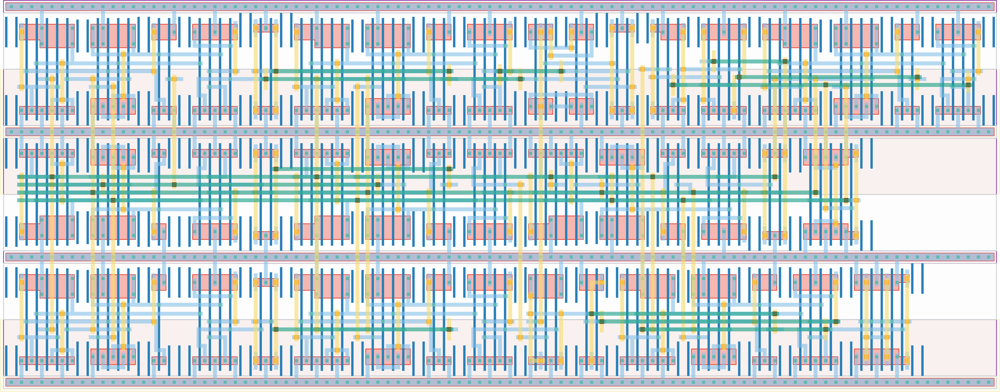

# `end_detector` Module


## Cell Hierarchy

`end_detector` **163** (number MOS pairs)
- `dff_st_ar` **15** *x6*
- `inv` **1** *x8*
- `xor2` **6**
- `nand3` **3**
- `tff_st_ar` **15**
- `mux2` **7**
- `buf_wide` **2** *x2*
- `nand2` **2**
- `dff_st_ar_dh` **14** *x2*

## Netlist

```
.SUBCKT end_detector in0 in1 rand ready rst rst' vdd vss
    Xi20 in1 ready_fb ready_int ready_int' rst rst' vdd vss dff_st_ar
    Xi19 in1 muxout rand_int net050 rst rst' vdd vss dff_st_ar
    Xi5 in1 net4 vdl1s1 net12 rst rst' vdd vss dff_st_ar
    Xi3 in0 net5 vdl0s1 net26 rst rst' vdd vss dff_st_ar
    Xi1 in1 net6 sample1 net40 rst rst' vdd vss dff_st_ar
    Xi0 in1 in0 sample0 net47 rst rst' vdd vss dff_st_ar
    Xi17 net037 net029 vdd vss inv
    Xi16 tff net037 vdd vss inv
    Xi11 net7 net4 vdd vss inv
    Xi10 vdl1s0 net7 vdd vss inv
    Xi9 net8 net5 vdd vss inv
    Xi8 vdl0s0 net8 vdd vss inv
    Xi7 net9 net6 vdd vss inv
    Xi6 sample0 net9 vdd vss inv
    Xi12 sample0 sample1 xor vdd vss xor2
    Xi13 xor vdl0s1 vdl1s1 ready' vdd vss nand3
    Xi15 in1 tff net059 rst rst' vdd vss tff_st_ar
    Xi18 net029 rand_int muxout ready_int vdd vss mux2
    Xi23 ready_int ready vdd vss buf_wide
    Xi22 rand_int rand vdd vss buf_wide
    Xi24 ready' ready_int' ready_fb vdd vss nand2
    Xi4 in1 vdl1s0 net19 rst rst' vdd vss dff_st_ar_dh
    Xi2 in0 vdl0s0 net33 rst rst' vdd vss dff_st_ar_dh
.ENDS
```
