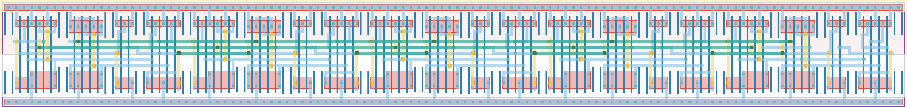

# `ext_clk_cnt_chain` Module


## Cell Hierarchy

`ext_clk_cnt_chain` **75** (number MOS pairs)
- `tff_st_ar` **15** *x5*

## Netlist

```
.SUBCKT ext_clk_cnt_chain clk out<0> out<1> out<2> out<3> out<4> rst rst' vdd vss
    Xi4 net13 out<4> net10 rst rst' vdd vss tff_st_ar
    Xi3 net16 out<3> net13 rst rst' vdd vss tff_st_ar
    Xi2 net19 out<2> net16 rst rst' vdd vss tff_st_ar
    Xi1 net21 out<1> net19 rst rst' vdd vss tff_st_ar
    Xi0 clk out<0> net21 rst rst' vdd vss tff_st_ar
.ENDS
```
