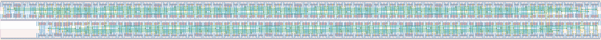

# `ext_clk_data_chain` Module


## Cell Hierarchy

`ext_clk_data_chain` **478** (number MOS pairs)
- `ext_clk_data_chain_el` **29** *x16*
- `dff_st_ar_dh` **14**

## Netlist

```
.SUBCKT ext_clk_data_chain conf_bit'cnt data_out ext_clk in_bit<0> in_bit<1> in_bit<2> in_bit<3>
                           + in_bit<4> in_bit<5> in_bit<6> in_bit<7> in_cnt<0> in_cnt<1> in_cnt<2>
                           + in_cnt<3> in_cnt<4> in_cnt<5> in_cnt<6> in_cnt<7> in_cnt<8> in_cnt<9>
                           + in_cnt<10> in_cnt<11> in_cnt<12> in_cnt<13> in_cnt<14> in_cnt_0 rst
                           + rst' vdd vss
    Xi63 conf_bit'cnt ext_clk int<7> in_bit<0> in_cnt<7> int<8> rst rst' send vdd vss
         + ext_clk_data_chain_el
    Xi62 conf_bit'cnt ext_clk int<14> in_bit<7> in_cnt<14> data_out rst rst' send vdd vss
         + ext_clk_data_chain_el
    Xi61 conf_bit'cnt ext_clk int<13> in_bit<6> in_cnt<13> int<14> rst rst' send vdd vss
         + ext_clk_data_chain_el
    Xi60 conf_bit'cnt ext_clk int<12> in_bit<5> in_cnt<12> int<13> rst rst' send vdd vss
         + ext_clk_data_chain_el
    Xi59 conf_bit'cnt ext_clk int<11> in_bit<4> in_cnt<11> int<12> rst rst' send vdd vss
         + ext_clk_data_chain_el
    Xi58 conf_bit'cnt ext_clk int<10> in_bit<3> in_cnt<10> int<11> rst rst' send vdd vss
         + ext_clk_data_chain_el
    Xi57 conf_bit'cnt ext_clk int<9> in_bit<2> in_cnt<9> int<10> rst rst' send vdd vss
         + ext_clk_data_chain_el
    Xi56 conf_bit'cnt ext_clk int<8> in_bit<1> in_cnt<8> int<9> rst rst' send vdd vss
         + ext_clk_data_chain_el
    Xi55 conf_bit'cnt ext_clk int<6> rst in_cnt<6> int<7> rst rst' send vdd vss
         + ext_clk_data_chain_el
    Xi54 conf_bit'cnt ext_clk int<5> rst in_cnt<5> int<6> rst rst' send vdd vss
         + ext_clk_data_chain_el
    Xi53 conf_bit'cnt ext_clk int<4> rst in_cnt<4> int<5> rst rst' send vdd vss
         + ext_clk_data_chain_el
    Xi52 conf_bit'cnt ext_clk int<3> rst in_cnt<3> int<4> rst rst' send vdd vss
         + ext_clk_data_chain_el
    Xi51 conf_bit'cnt ext_clk int<2> rst in_cnt<2> int<3> rst rst' send vdd vss
         + ext_clk_data_chain_el
    Xi50 conf_bit'cnt ext_clk int<1> rst in_cnt<1> int<2> rst rst' send vdd vss
         + ext_clk_data_chain_el
    Xi49 conf_bit'cnt ext_clk int<0> rst in_cnt<0> int<1> rst rst' send vdd vss
         + ext_clk_data_chain_el
    Xi48 conf_bit'cnt ext_clk rst rst in_cnt_0 int<0> rst rst' send vdd vss ext_clk_data_chain_el
    Xi64 ext_clk send net073 rst rst' vdd vss dff_st_ar_dh
.ENDS
```
