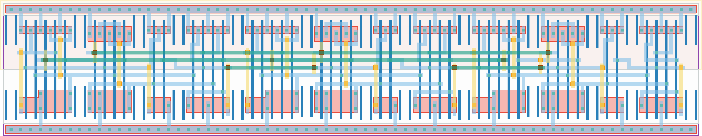

# `freq_scaler_248` Module


## Cell Hierarchy

`freq_scaler_248` **45** (number MOS pairs)
- `tff_st_ar` **15** *x3*

## Netlist

```
.SUBCKT freq_scaler_248 clk out<0> out<1> out<2> rst rst' vdd vss
    Xi2 out<1> net6 out<2> rst rst' vdd vss tff_st_ar
    Xi1 clk net9 out<0> rst rst' vdd vss tff_st_ar
    Xi0 out<0> net13 out<1> rst rst' vdd vss tff_st_ar
.ENDS
```
