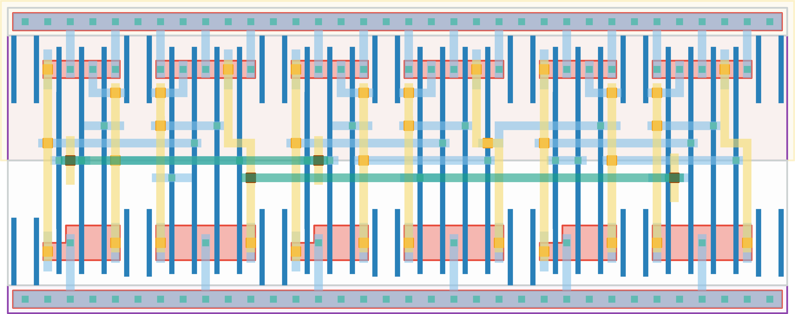

# `mux4` Module


## Cell Hierarchy

`mux4` **21** (number MOS pairs)
- `mux2` **7** *x3*

## Netlist

```
.SUBCKT mux4 in<0> in<1> in<2> in<3> out sel<0> sel<1> vdd vss
    Xi2 in<2> in<3> net5 sel<0> vdd vss mux2
    Xi1 in<0> in<1> net6 sel<0> vdd vss mux2
    Xi0 net6 net5 out sel<1> vdd vss mux2
.ENDS
```
