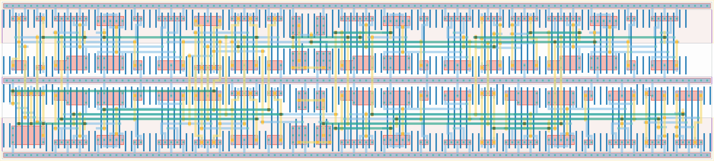

# `rst_start` Module


## Cell Hierarchy

`rst_start` **132** (number MOS pairs)
- `mux2` **7** *x2*
- `nand2` **2** *x6*
- `nor5` **5**
- `inv` **1** *x3*
- `nor2` **2** *x5*
- `nand2_wide` **2**
- `nor2_wide` **2**
- `dff_st_ar_dh` **14** *x6*

## Netlist

```
.SUBCKT rst_start conf_fb dc_rst_0 dc_rst_1 edge_0 edge_1 rst rst' rst_glob rst_glob' start_glob
                  + start_loc vdd vss
    Xi61 start_glob start_loc_int start_loc conf_fb vdd vss mux2
    Xi55 start_glob_level q_2' start_mux start_sel vdd vss mux2
    Xi48 rst_glob' ar_2_loc' ar_2 vdd vss nand2
    Xi47 rst_glob' ar_1_loc' ar_1 vdd vss nand2
    Xi40 q_1 q_2' rst_loc' vdd vss nand2
    Xi38 edge_0 edge_1 nand vdd vss nand2
    Xi45 q_1' q_2 ar_2_loc' vdd vss nand2
    Xi44 q_1 q_2 ar_1_loc' vdd vss nand2
    Xi63 edge_0 edge_1 dc_rst_0 dc_rst_1 q_1' nor vdd vss nor5
    Xi57 net038 net032 vdd vss inv
    Xi56 net031 net038 vdd vss inv
    Xi37 nand and vdd vss inv
    Xi50 rst_glob ar_2_loc ar_2' vdd vss nor2
    Xi49 rst_glob ar_1_loc ar_1' vdd vss nor2
    Xi43 q_1 q_2' ar_2_loc vdd vss nor2
    Xi42 q_1' q_2' ar_1_loc vdd vss nor2
    Xi41 q_1' q_2 rst_loc vdd vss nor2
    Xi59 rst_glob' rst_loc' rst vdd vss nand2_wide
    Xi60 rst_glob rst_loc rst' vdd vss nor2_wide
    Xi58 net032 start_loc_int net039 rst rst' vdd vss dff_st_ar_dh
    Xi53 start_glob start_glob_level net040 rst_glob rst_glob' vdd vss dff_st_ar_dh
    Xi54 start_loc_int start_sel net034 rst_glob rst_glob' vdd vss dff_st_ar_dh
    Xi36 nor q_2 q_2' ar_2 ar_2' vdd vss dff_st_ar_dh
    Xi46 start_mux net031 net023 rst rst' vdd vss dff_st_ar_dh
    Xi35 and q_1 q_1' ar_1 ar_1' vdd vss dff_st_ar_dh
.ENDS
```
