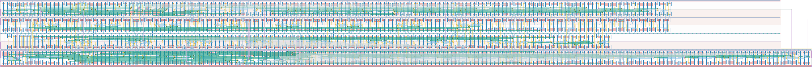

# `send_top` Module


## Cell Hierarchy

`send_top` **1303** (number MOS pairs)
- `bit_control` **119**
- `ext_clk_data_chain` **478**
- `bit_cnt_chain` **60**
- `bit_data_chain` **136**
- `ext_clk_cnt_chain` **75**
- `clk_delay_6` **6**
- `cnt_data_chain` **225**
- `mux2` **7** *x5*
- `nand2` **2** *x2*
- `nor2` **2** *x2*
- `cnt_control` **146**
- `dff_st_ar` **15**

## Netlist

```
.SUBCKT send_top conf_bit'cnt data_out data_ready ext_clk rand ready rst rst' vdd vdl_rst vdl_rst'
                 + vss
    Xi0 bit_cnt<0> bit_cnt<1> bit_cnt<2> bit_cnt<3> bit_data<0> bit_data<1> bit_data<2> bit_data<3>
        + bit_data<4> bit_data<5> bit_data<6> bit_data<7> bit_ready bit_rst bit_rst' extclk_cnt<0>
        + extclk_cnt<1> extclk_cnt<2> extclk_cnt<3> extclk_cnt<4> ext_clk ready_clk rst rst' vdd
        + bit_vdl_rst_loc bit_vdl_rst_loc' vss bit_control
    Xi1 conf_bit'cnt data_out ext_clk bit_data<0> bit_data<1> bit_data<2> bit_data<3> bit_data<4>
        + bit_data<5> bit_data<6> bit_data<7> cnt_data<0> cnt_data<1> cnt_data<2> cnt_data<3>
        + cnt_data<4> cnt_data<5> cnt_data<6> cnt_data<7> cnt_data<8> cnt_data<9> cnt_data<10>
        + cnt_data<11> cnt_data<12> cnt_data<13> cnt_data<14> rand_fix int_rst int_rst' vdd vss
        + ext_clk_data_chain
    Xi2 ready_clk bit_cnt<0> bit_cnt<1> bit_cnt<2> bit_cnt<3> bit_rst bit_rst' vdd vss bit_cnt_chain
    Xi3 ready_clk rand bit_data<0> bit_data<1> bit_data<2> bit_data<3> bit_data<4> bit_data<5>
        + bit_data<6> bit_data<7> bit_rst bit_rst' vdd vss bit_data_chain
    Xi4 ext_clk extclk_cnt<0> extclk_cnt<1> extclk_cnt<2> extclk_cnt<3> extclk_cnt<4> int_rst
        + int_rst' vdd vss ext_clk_cnt_chain
    Xi5 ready ready_clk vdd vss clk_delay_6
    Xi6 cnt_data<0> cnt_data<1> cnt_data<2> cnt_data<3> cnt_data<4> cnt_data<5> cnt_data<6>
        + cnt_data<7> cnt_data<8> cnt_data<9> cnt_data<10> cnt_data<11> cnt_data<12> cnt_data<13>
        + cnt_data<14> rand cnt_rst cnt_rst' vdd vss cnt_data_chain
    Xi11 bit_ready cnt_ready data_ready conf_bit'cnt vdd vss mux2
    Xi10 bit_rst' cnt_rst' int_rst_loc' conf_bit'cnt vdd vss mux2
    Xi9 bit_rst cnt_rst int_rst_loc conf_bit'cnt vdd vss mux2
    Xi8 bit_vdl_rst_loc' cnt_vdl_rst_loc' vdl_rst_loc' conf_bit'cnt vdd vss mux2
    Xi7 bit_vdl_rst_loc cnt_vdl_rst_loc vdl_rst_loc conf_bit'cnt vdd vss mux2
    Xi13 int_rst_loc' rst' int_rst vdd vss nand2
    Xi12 vdl_rst_loc' rst' vdl_rst vdd vss nand2
    Xi15 int_rst_loc rst int_rst' vdd vss nor2
    Xi14 vdl_rst_loc rst vdl_rst' vdd vss nor2
    Xi16 cnt_data<0> cnt_data<1> cnt_data<2> cnt_data<3> cnt_data<4> cnt_data<5> cnt_data<6>
         + cnt_data<7> cnt_data<8> cnt_data<9> cnt_data<10> cnt_data<11> cnt_data<12> cnt_data<13>
         + cnt_data<14> cnt_ready cnt_rst cnt_rst' extclk_cnt<0> extclk_cnt<1> extclk_cnt<2>
         + extclk_cnt<3> extclk_cnt<4> ext_clk ready_clk rst rst' vdd cnt_vdl_rst_loc
         + cnt_vdl_rst_loc' vss cnt_control
    Xi17 ready_clk rand rand_fix net34 cnt_rst cnt_rst' vdd vss dff_st_ar
.ENDS
```
