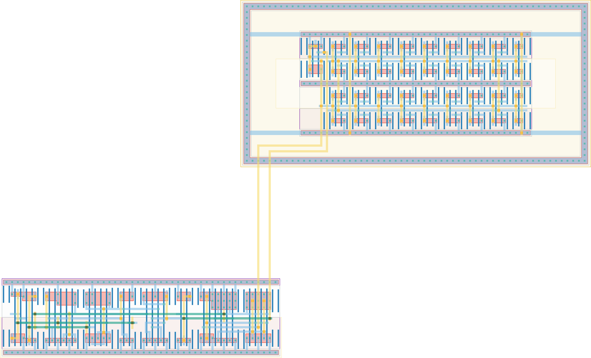

# `vdl_branch` Module


## Cell Hierarchy

`vdl_branch` **60** (number MOS pairs)
- `edge_to_level` **21**
- `vdl_oo_3` **36**
- `buf_en` **3**

## Netlist

```
.SUBCKT vdl_branch conf'<0> conf'<1> conf'<2> conf'<3> conf'<4> conf'<5> conf'<6> conf'<7> conf'<8>
                   + conf'<9> conf'<10> conf'<11> conf'<12> conf'<13> conf'<14> conf'<15> conf<0>
                   + conf<1> conf<2> conf<3> conf<4> conf<5> conf<6> conf<7> conf<8> conf<9>
                   + conf<10> conf<11> conf<12> conf<13> conf<14> conf<15> conf_enhigh' edge enable
                   + enable' out rst rst' vdd vdd_vdl vss vss_vdl
    Xi0 conf_enhigh' edge enable enable' enable_int rst rst' vdd vss edge_to_level
    Xi1 conf'<0> conf'<1> conf'<2> conf'<3> conf'<4> conf'<5> conf'<6> conf'<7> conf'<8> conf'<9>
        + conf'<10> conf'<11> conf'<12> conf'<13> conf'<14> conf'<15> conf<0> conf<1> conf<2>
        + conf<3> conf<4> conf<5> conf<6> conf<7> conf<8> conf<9> conf<10> conf<11> conf<12>
        + conf<13> conf<14> conf<15> enable_int ro_out vdd_vdl vss_vdl vdl_oo_3
    Xi3 enable ro_out out vdd vss buf_en
.ENDS
```
