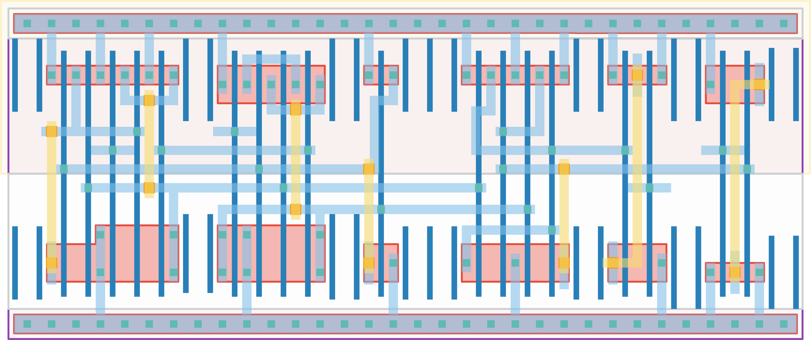

# `vdl_enable` Module


## Cell Hierarchy

`vdl_enable` **18** (number MOS pairs)
- `nand2` **2**
- `nor2` **2**
- `dff_st_ar_dh` **14**

## Netlist

```
.SUBCKT vdl_enable conf_enhigh conf_enhigh' enable enable' ready rst rst' vdd vss
    Xi1 enable_loc' conf_enhigh' enable vdd vss nand2
    Xi2 enable_loc conf_enhigh enable' vdd vss nor2
    Xi0 ready enable_loc' enable_loc rst rst' vdd vss dff_st_ar_dh
.ENDS
```
