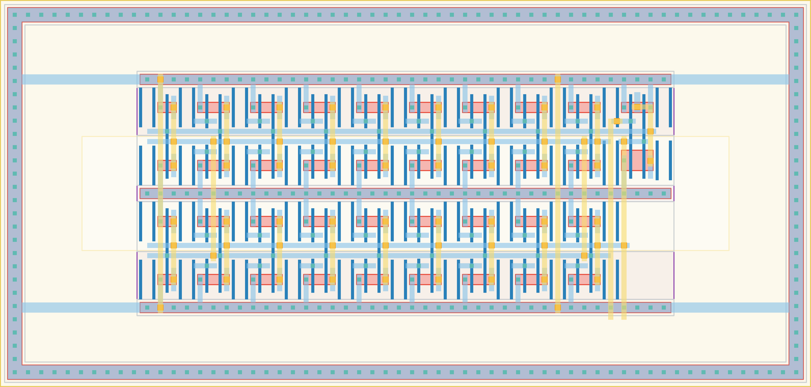

# `vdl_oo_3` Module


## Cell Hierarchy

`vdl_oo_3` **36** (number MOS pairs)
- `vdl_oo_2` **34**
- `nand2_dnw` **2**

## Netlist

```
.SUBCKT vdl_oo_3 conf'<0> conf'<1> conf'<2> conf'<3> conf'<4> conf'<5> conf'<6> conf'<7> conf'<8>
                 + conf'<9> conf'<10> conf'<11> conf'<12> conf'<13> conf'<14> conf'<15> conf<0>
                 + conf<1> conf<2> conf<3> conf<4> conf<5> conf<6> conf<7> conf<8> conf<9> conf<10>
                 + conf<11> conf<12> conf<13> conf<14> conf<15> enable out vdd vss
    Xi0 conf'<0> conf'<1> conf'<2> conf'<3> conf'<4> conf'<5> conf'<6> conf'<7> conf'<8> conf'<9>
        + conf'<10> conf'<11> conf'<12> conf'<13> conf'<14> conf'<15> conf<0> conf<1> conf<2>
        + conf<3> conf<4> conf<5> conf<6> conf<7> conf<8> conf<9> conf<10> conf<11> conf<12>
        + conf<13> conf<14> conf<15> nand out vdd vss vdl_oo_2
    Xi1 out enable nand vdd vss nand2_dnw
.ENDS
```
